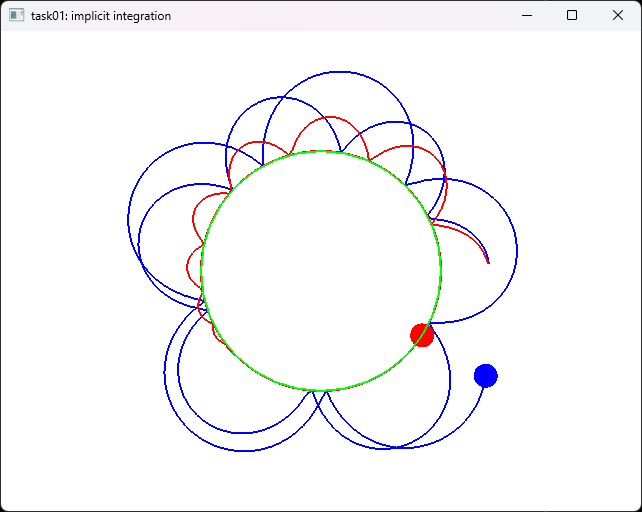
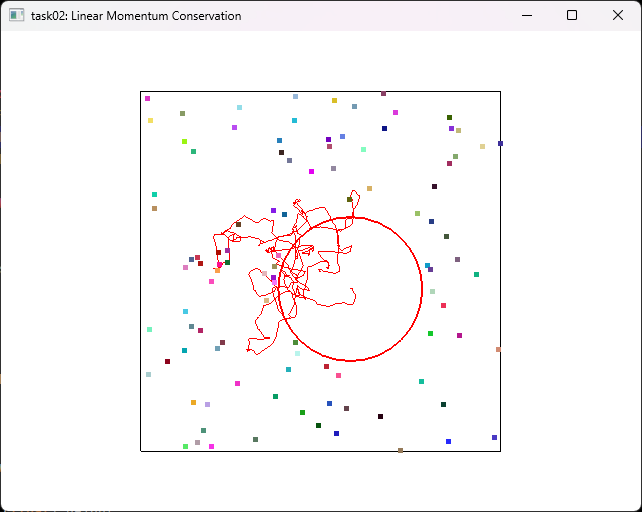
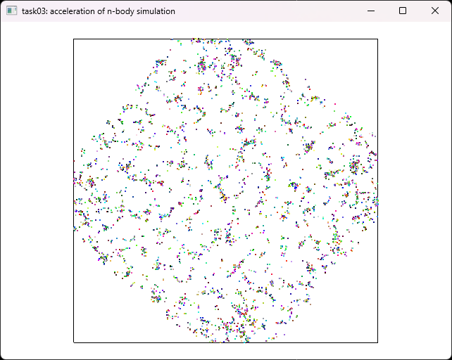
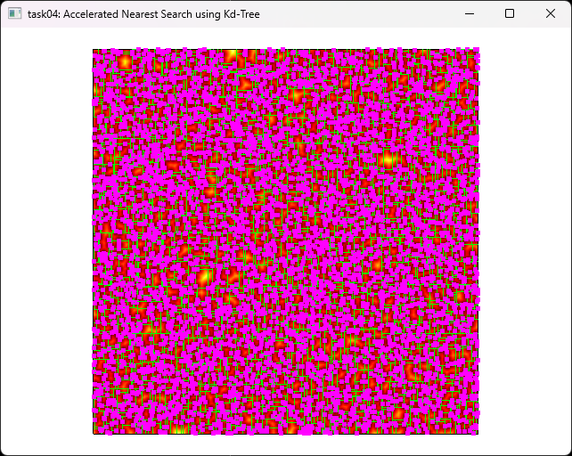
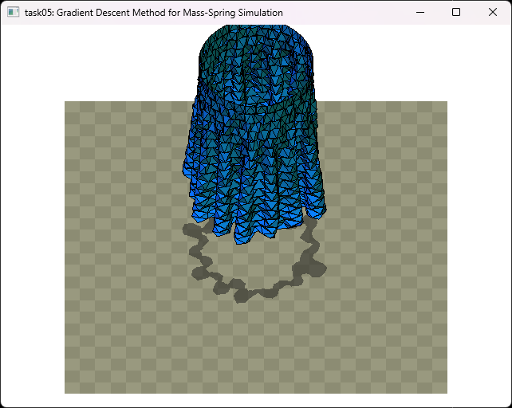
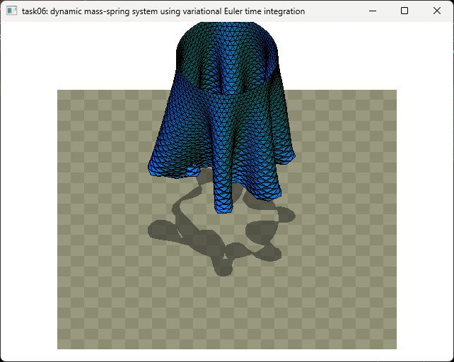
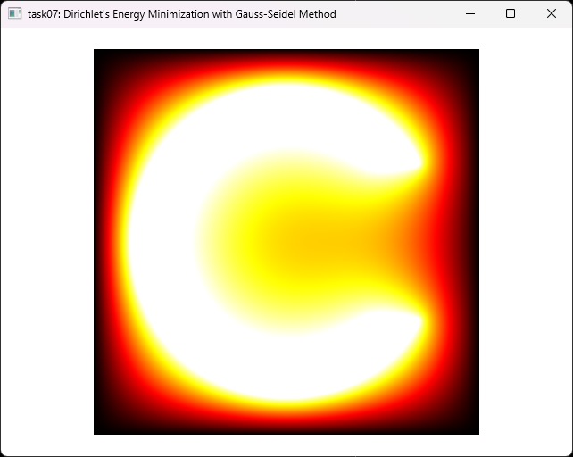
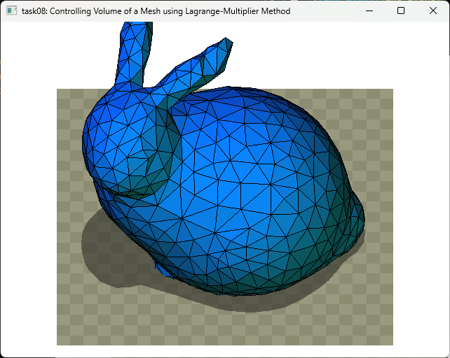
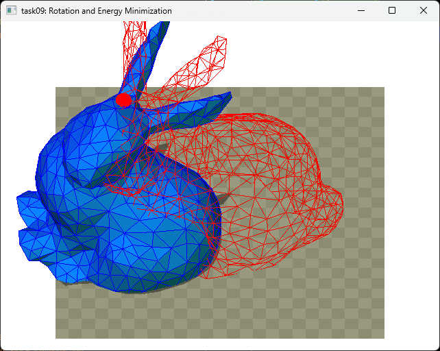
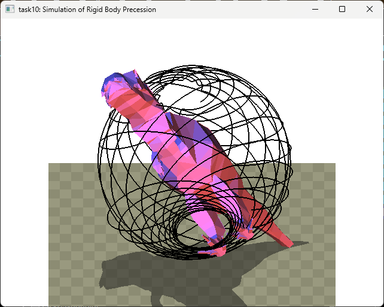

# Physics-based Animation 4860-1081 2023S

## Task Results (native implemetation)
| task 1 | task 2 | task 3 | task 4 | task 5 |
| :-: | :-: | :-: | :-: | :-: |
|  |  |  |  |  |
| task 6 | task 7 | task 8 | task 9 | task 10 |
|  |  |  |  |  |
